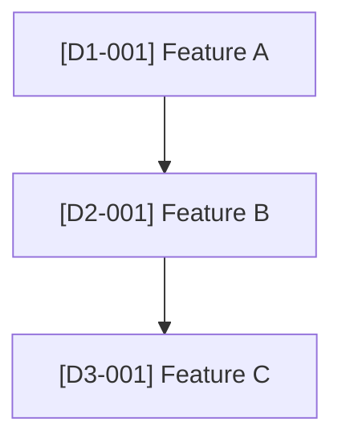

# Feature Map

> **Fill this in.** A complete inventory of every product feature — its current status, domain, dependencies, and governing requirement. Agents read this to understand what exists before planning new work, and write to it when features are approved or shipped.
>
> **Status values**: `idea` → `planned` → `in-progress` → `shipped` → `deprecated`
>
> **Updated by**: Refinement agent (on approval), Planning agent (on completion).

---

## Feature Domains

<!-- Replace these domains with the top-level areas of YOUR product. -->

| Domain | Description |
|--------|-------------|
| [Domain 1] | [What this area covers] |
| [Domain 2] | [What this area covers] |
| [Domain 3] | [What this area covers] |

---

## How to Add a Feature

```markdown
| [ID] | [Feature name] | `planned` | [Depends on IDs, or "—"] | [#issue or "—"] | [session ID or "—"] |
```

ID format: `[DOMAIN_ABBREV]-[NNN]` e.g., `AUTH-001`, `BILLING-003`, `DASH-012`

---

## Feature Map

### Domain: [Domain 1]

| ID | Feature | Status | Depends On | Issue | Session |
|----|---------|--------|-----------|-------|---------|
| [D1-001] | [Feature name] | `idea` | — | — | — |

---

### Domain: [Domain 2]

| ID | Feature | Status | Depends On | Issue | Session |
|----|---------|--------|-----------|-------|---------|
| [D2-001] | [Feature name] | `idea` | — | — | — |

---

### Domain: [Domain 3]

| ID | Feature | Status | Depends On | Issue | Session |
|----|---------|--------|-----------|-------|---------|
| [D3-001] | [Feature name] | `idea` | — | — | — |

---

## Dependency Graph

<!-- Update this diagram as features are added. Use Mermaid flowchart syntax. -->



---

## Status Summary

| Status | Count |
|--------|-------|
| `idea` | 0 |
| `planned` | 0 |
| `in-progress` | 0 |
| `shipped` | 0 |
| `deprecated` | 0 |
