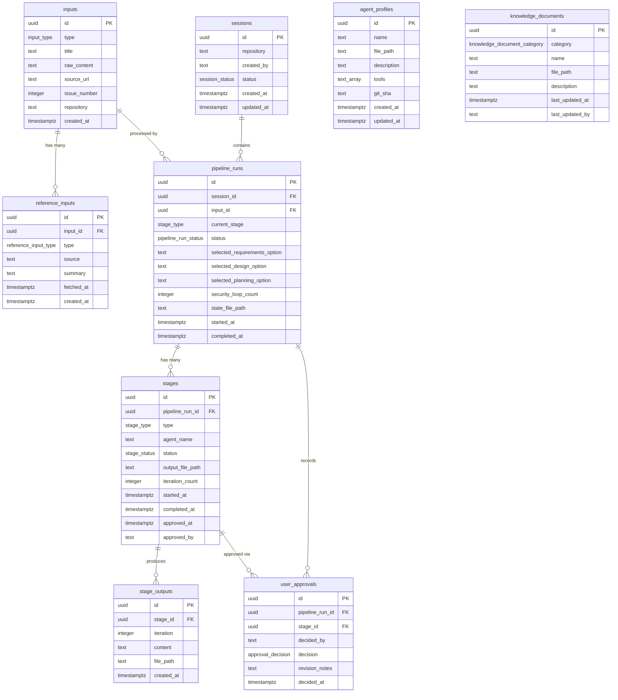

# Entity Relationship Diagram

> Generated from `base-schema.sql`. Update whenever the schema changes.
> Rendered with [Mermaid](https://mermaid.js.org/syntax/entityRelationshipDiagram.html).

---

---

## Relationship Cardinalities

| From | Relationship | To | Description |
|------|-------------|-----|-------------|
| `inputs` | one-to-many | `reference_inputs` | One input can have 0–N reference materials |
| `sessions` | one-to-many | `pipeline_runs` | A session holds all runs for a product context |
| `inputs` | one-to-many | `pipeline_runs` | An input can be re-processed (e.g., after revision) |
| `pipeline_runs` | one-to-many | `stages` | Each run executes up to 7 stages |
| `stages` | one-to-many | `stage_outputs` | A stage can produce multiple outputs (one per retry) |
| `pipeline_runs` | one-to-many | `user_approvals` | Each approval checkpoint is logged |
| `stages` | one-to-many | `user_approvals` | Each stage may be approved multiple times (revision cycle) |

---

## Notes

- `agent_profiles` and `knowledge_documents` are **reference tables** — they are seeded at deploy time and updated as agents or knowledge files are added. They are not linked via foreign keys to other tables to keep them loosely coupled.
- All tables use `UUID` primary keys generated by `gen_random_uuid()` to prevent enumeration attacks.
- The `stage_outputs.content` field stores the full markdown text; `file_path` points to the in-repo copy. Both are kept in sync by the writing agent.
