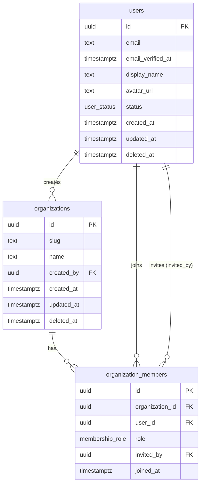

# Entity Relationship Diagram

> **Fill this in.** Update this diagram whenever the schema changes. Keep it in sync with `base-schema.sql` and `domain-model.md`.
> Rendered with [Mermaid](https://mermaid.js.org/syntax/entityRelationshipDiagram.html).

---

## Current ERD

---

## Relationship Cardinalities

| From | Relationship | To | Notes |
|------|-------------|-----|-------|
| `users` | one-to-many | `organizations` | A user can create multiple orgs |
| `organizations` | one-to-many | `organization_members` | An org has many member records |
| `users` | one-to-many | `organization_members` | A user can be in multiple orgs |

---

## Notes

- All tables use `UUID` primary keys generated by `gen_random_uuid()` to prevent enumeration.
- Soft-deleted rows (`deleted_at IS NOT NULL`) are excluded from unique indexes.
- Add new entities to both this diagram and `base-schema.sql` when the schema changes.
