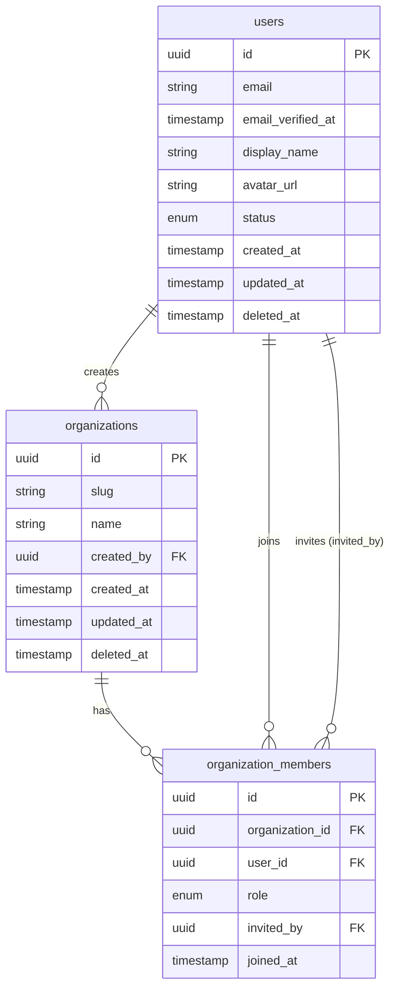

# Entity Relationship Diagram

> **Fill this in.** Update this diagram whenever the data model changes. Keep it in sync with `schema.md` and `domain-model.md`.
>
> Rendered with [Mermaid](https://mermaid.js.org/syntax/entityRelationshipDiagram.html).
> Field types here are **logical types** (string, timestamp, enum, reference) — not tied to any specific database technology.

---

## Current ERD

---

## Relationship Cardinalities

| From | Relationship | To | Notes |
|------|-------------|-----|-------|
| `users` | one-to-many | `organizations` | A user can create multiple orgs |
| `organizations` | one-to-many | `organization_members` | An org has many member records |
| `users` | one-to-many | `organization_members` | A user can be in multiple orgs |

---

## Notes

- Field types in this diagram are logical (database-agnostic). Translate them to the appropriate native type when implementing in your chosen database.
- Soft-deleted entities carry a nullable `deleted_at` timestamp; `null` means the record is active.
- Add new entities to both this diagram and `schema.md` when the data model changes.
